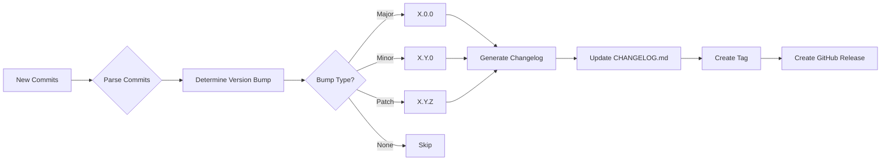

# Release Build Flow Action 🚀

[](https://github.com/marketplace/actions/release-build-flow-action) [](https://opensource.org/licenses/MIT) [](https://github.com/wgtechlabs)

> **Automated release creation and changelog maintenance using Clean Commit convention and Keep a Changelog format.**  
> Zero-intervention release automation with deterministic logic—no AI required!

Stop manually managing versions, changelogs, and GitHub Releases. This action automatically detects new commits, determines version bumps using semantic versioning, generates structured changelogs following the Keep a Changelog format, and creates GitHub Releases—all from your Clean Commit messages.

---

## 🎯 Why Use This Action?

**The Problem:**  
Managing releases is tedious and error-prone. Teams spend time manually:
- Deciding version numbers
- Writing changelogs
- Creating Git tags
- Publishing GitHub Releases
- Categorizing changes consistently

**The Solution:**  
One action that analyzes your conventional commits and automatically handles everything. Push code with Clean Commit messages, and get semantic versioning, categorized changelogs, and professional releases—every time.

---

## 🔍 How It Works



**Fully deterministic—no AI, no guessing.** The action parses your commit messages, maps types to changelog sections, bumps versions based on configurable rules, and creates releases with structured content.

---

## ✨ Features

- 🎯 **Intelligent Version Bumping** - Automatically determines MAJOR.MINOR.PATCH based on commit types
- 📝 **Keep a Changelog Format** - Maintains CHANGELOG.md with proper sections (Added, Changed, Fixed, etc.)
- 🏷️ **Clean Commit Parsing** - Maps conventional commit types to changelog categories
- 🚀 **GitHub Release Creation** - Automated releases with changelog content
- ⚙️ **Highly Configurable** - Customize type mappings, exclusions, and version bump rules
- 🔒 **Deterministic Logic** - No AI dependencies, purely rule-based
- 📊 **Rich Outputs** - Version info, commit counts, categorized change counts, and release URLs

---

## 📋 Commit Type Mapping

This action uses conventional commits (Clean Commit convention) and maps them to Keep a Changelog sections:

| Commit Type | Changelog Section | Examples |
|-------------|-------------------|----------|
| `feat`, `new`, `add` | **Added** | New features, capabilities |
| `fix`, `bugfix` | **Fixed** | Bug fixes, corrections |
| `security` | **Security** | Security patches, vulnerability fixes |
| `perf`, `refactor`, `update`, `change`, `chore` | **Changed** | Performance improvements, refactoring |
| `deprecate` | **Deprecated** | Soon-to-be removed features |
| `remove`, `delete` | **Removed** | Removed features, deleted code |

**Breaking Changes:** Commits with `!` suffix or `BREAKING CHANGE` in body trigger **major** version bumps.

**Excluded by default:** `docs`, `style`, `test`, `ci`, `build` (configurable via `exclude-types`)

---

## 🚀 Quick Start

### Basic Usage

```yaml
name: Release

on:
  push:
    branches: [main]

jobs:
  release:
    runs-on: ubuntu-latest
    steps:
      - uses: actions/checkout@v4
        with:
          fetch-depth: 0  # Required for full git history
      
      - name: Create Release
        uses: wgtechlabs/release-build-flow-action@v1
        with:
          github-token: ${{ secrets.GITHUB_TOKEN }}
```

### Custom Configuration

```yaml
- name: Create Release with Custom Settings
  uses: wgtechlabs/release-build-flow-action@v1
  with:
    github-token: ${{ secrets.GITHUB_TOKEN }}
    version-prefix: 'v'
    initial-version: '1.0.0'
    changelog-path: './CHANGELOG.md'
    release-name-template: 'Release {version} - {date}'
    exclude-types: 'docs,style,test,ci'
```

### Prerelease Support

```yaml
- name: Create Beta Release
  uses: wgtechlabs/release-build-flow-action@v1
  with:
    github-token: ${{ secrets.GITHUB_TOKEN }}
    prerelease-prefix: 'beta'
    release-prerelease: true
```

### Tag Only (No Release)

```yaml
- name: Create Version Tag
  uses: wgtechlabs/release-build-flow-action@v1
  with:
    github-token: ${{ secrets.GITHUB_TOKEN }}
    tag-only: true
```

---

## 📖 Inputs

### GitHub Configuration

| Input | Description | Default |
|-------|-------------|---------|
| `github-token` | GitHub token for creating releases and tags | `${{ github.token }}` |

### Branch Configuration

| Input | Description | Default |
|-------|-------------|---------|
| `main-branch` | Name of the main/production branch | `main` |
| `dev-branch` | Name of the development branch | `dev` |

### Version Configuration

| Input | Description | Default |
|-------|-------------|---------|
| `version-prefix` | Prefix for version tags (e.g., `v` for `v1.2.3`) | `v` |
| `initial-version` | Initial version if no tags exist | `0.1.0` |
| `prerelease-prefix` | Prefix for prerelease versions (e.g., `beta`, `alpha`, `rc`) | `` |

### Changelog Configuration

| Input | Description | Default |
|-------|-------------|---------|
| `changelog-path` | Path to CHANGELOG.md file | `./CHANGELOG.md` |
| `changelog-enabled` | Enable automatic changelog generation | `true` |
| `commit-changelog` | Commit and push changelog changes back to repository | `true` |

### Commit Type Mapping

| Input | Description | Default |
|-------|-------------|---------|
| `commit-type-mapping` | JSON mapping of commit types to changelog sections | Standard mapping |
| `exclude-types` | Comma-separated list of commit types to exclude | `docs,style,test,ci,build` |
| `exclude-scopes` | Comma-separated list of commit scopes to exclude | `` |

### Version Bump Rules

| Input | Description | Default |
|-------|-------------|---------|
| `major-keywords` | Keywords that trigger major version bump | `BREAKING CHANGE,BREAKING-CHANGE,breaking` |
| `minor-keywords` | Keywords that trigger minor version bump | `feat,new,add` |
| `patch-keywords` | Keywords that trigger patch version bump | `fix,bugfix,security,perf` |

### Release Configuration

| Input | Description | Default |
|-------|-------------|---------|
| `create-release` | Enable GitHub Release creation | `true` |
| `release-draft` | Create release as draft | `false` |
| `release-prerelease` | Mark release as prerelease | `false` |
| `release-name-template` | Template for release name (supports `{version}`, `{date}`) | `Release {version}` |

### Git Configuration

| Input | Description | Default |
|-------|-------------|---------|
| `git-user-name` | Git user name for commits | `github-actions[bot]` |
| `git-user-email` | Git user email for commits | `github-actions[bot]@users.noreply.github.com` |

### Advanced Options

| Input | Description | Default |
|-------|-------------|---------|
| `dry-run` | Run without creating tags or releases (testing mode) | `false` |
| `tag-only` | Only create tag without GitHub Release | `false` |
| `fetch-depth` | Number of commits to fetch for changelog (0 for all) | `0` |
| `include-all-commits` | Include all commits in changelog, not just since last tag | `false` |

---

## 📤 Outputs

### Version Outputs

| Output | Description |
|--------|-------------|
| `version` | Generated version number (e.g., `1.2.3`) |
| `version-tag` | Full version tag with prefix (e.g., `v1.2.3`) |
| `previous-version` | Previous version number |
| `version-bump-type` | Type of version bump (`major`, `minor`, `patch`, or `none`) |

### Release Outputs

| Output | Description |
|--------|-------------|
| `release-created` | Whether a release was created (`true`/`false`) |
| `release-id` | GitHub Release ID |
| `release-url` | GitHub Release URL |
| `release-upload-url` | GitHub Release upload URL for assets |

### Changelog Outputs

| Output | Description |
|--------|-------------|
| `changelog-updated` | Whether changelog was updated (`true`/`false`) |
| `changelog-entry` | Generated changelog entry for this version |
| `commit-count` | Number of commits included in this release |

### Categorized Commit Counts

| Output | Description |
|--------|-------------|
| `added-count` | Number of Added changes |
| `changed-count` | Number of Changed items |
| `deprecated-count` | Number of Deprecated items |
| `removed-count` | Number of Removed items |
| `fixed-count` | Number of Fixed items |
| `security-count` | Number of Security fixes |

---

## 💡 Examples

### Example 1: Basic Release Workflow

```yaml
name: Release

on:
  push:
    branches: [main]

jobs:
  release:
    runs-on: ubuntu-latest
    steps:
      - name: Checkout code
        uses: actions/checkout@v4
        with:
          fetch-depth: 0
      
      - name: Create Release
        id: release
        uses: wgtechlabs/release-build-flow-action@v1
        with:
          github-token: ${{ secrets.GITHUB_TOKEN }}
      
      - name: Display Results
        run: |
          echo "Version: ${{ steps.release.outputs.version }}"
          echo "Tag: ${{ steps.release.outputs.version-tag }}"
          echo "Release URL: ${{ steps.release.outputs.release-url }}"
          echo "Commits: ${{ steps.release.outputs.commit-count }}"
```

### Example 2: Custom Type Mapping

```yaml
- name: Release with Custom Mapping
  uses: wgtechlabs/release-build-flow-action@v1
  with:
    github-token: ${{ secrets.GITHUB_TOKEN }}
    commit-type-mapping: |
      {
        "feat": "Added",
        "feature": "Added",
        "fix": "Fixed",
        "bug": "Fixed",
        "security": "Security",
        "perf": "Changed",
        "improve": "Changed",
        "deprecate": "Deprecated",
        "remove": "Removed"
      }
```

### Example 3: Monorepo with Scoped Commits

```yaml
- name: Release Backend Package
  uses: wgtechlabs/release-build-flow-action@v1
  with:
    github-token: ${{ secrets.GITHUB_TOKEN }}
    exclude-scopes: 'frontend,docs,infra'  # Only include backend changes
```

### Example 4: Draft Release for Review

```yaml
- name: Create Draft Release
  uses: wgtechlabs/release-build-flow-action@v1
  with:
    github-token: ${{ secrets.GITHUB_TOKEN }}
    release-draft: true
```

### Example 5: Using Outputs for Notifications

```yaml
- name: Create Release
  id: release
  uses: wgtechlabs/release-build-flow-action@v1
  with:
    github-token: ${{ secrets.GITHUB_TOKEN }}

- name: Notify Slack
  if: steps.release.outputs.release-created == 'true'
  run: |
    curl -X POST ${{ secrets.SLACK_WEBHOOK }} \
      -H 'Content-Type: application/json' \
      -d '{
        "text": "🚀 New release: ${{ steps.release.outputs.version-tag }}\nAdded: ${{ steps.release.outputs.added-count }}, Fixed: ${{ steps.release.outputs.fixed-count }}\n${{ steps.release.outputs.release-url }}"
      }'
```

---

## 📚 Conventional Commit Examples

Here are examples of commits and their impact on versioning and changelog:

```bash
# MINOR version bump (0.1.0 -> 0.2.0)
feat: add user authentication
feat(api): implement OAuth2 login
new: support multiple themes

# PATCH version bump (0.1.0 -> 0.1.1)
fix: resolve memory leak in worker pool
bugfix(auth): correct token validation
security: patch XSS vulnerability in comments

# MAJOR version bump (0.1.0 -> 1.0.0)
feat!: redesign API endpoints
feat(api)!: change response format
# or in commit body:
feat: new API design

BREAKING CHANGE: Response format changed from XML to JSON

# Changes categorized as "Changed"
perf: improve database query performance
refactor: restructure authentication module
chore: update dependencies

# Changes categorized as "Deprecated"
deprecate: mark legacy API endpoints

# Changes categorized as "Removed"
remove: delete deprecated v1 endpoints

# Excluded from changelog (by default)
docs: update README
style: format code with prettier
test: add unit tests for auth
ci: update GitHub Actions workflow
```

---

## 📝 Generated CHANGELOG.md Example

```markdown
# Changelog

All notable changes to this project will be documented in this file.

The format is based on [Keep a Changelog](https://keepachangelog.com/en/1.1.0/),
and this project adheres to [Semantic Versioning](https://semver.org/spec/v2.0.0.html).

## [Unreleased]

## [1.2.0] - 2024-02-17

### Added
- User authentication with OAuth2
- Support for multiple themes
- Dark mode toggle

### Changed
- Improved database query performance by 40%
- Restructured authentication module for better maintainability

### Fixed
- Resolved memory leak in worker pool
- Corrected token validation in auth middleware

### Security
- Patched XSS vulnerability in comment system

## [1.1.0] - 2024-02-10

### Added
- API rate limiting

### Fixed
- Database connection timeout issues
```

---

## 🛠️ Development

### Testing Locally

To test the action locally without triggering releases:

```yaml
- name: Dry Run Test
  uses: wgtechlabs/release-build-flow-action@v1
  with:
    github-token: ${{ secrets.GITHUB_TOKEN }}
    dry-run: true
```

### Custom Workflows

You can use individual outputs to build custom workflows:

```yaml
- name: Create Release
  id: release
  uses: wgtechlabs/release-build-flow-action@v1
  with:
    github-token: ${{ secrets.GITHUB_TOKEN }}

- name: Build Artifacts
  if: steps.release.outputs.version-bump-type != 'none'
  run: |
    # Build your project
    npm run build
    
- name: Upload Release Assets
  if: steps.release.outputs.release-created == 'true'
  uses: actions/upload-release-asset@v1
  with:
    upload_url: ${{ steps.release.outputs.release-upload-url }}
    asset_path: ./dist/app.zip
    asset_name: app-${{ steps.release.outputs.version }}.zip
    asset_content_type: application/zip
```

---

## 🔧 Troubleshooting

### No version bump detected

**Cause:** No commits with version-bumping types since last release.

**Solution:** Ensure commits use conventional format with types like `feat`, `fix`, `new`, etc.

### Changelog not updating

**Cause:** `changelog-enabled` is set to `false` or no changes to include.

**Solution:** Verify `changelog-enabled: true` and check excluded types.

### Release not created

**Cause:** Insufficient permissions or `create-release` is disabled.

**Solution:** 
- Ensure `github-token` has `contents: write` permission
- Check `create-release` input is set to `true`

### Git permission errors

**Cause:** Action cannot push commits/tags.

**Solution:** Add repository permissions:

```yaml
permissions:
  contents: write
```

---

## 📄 License

MIT © [WG Technology Labs](https://github.com/wgtechlabs)

---

## 🤝 Contributing

Contributions are welcome! Please feel free to submit a Pull Request.

---

## 🙏 Acknowledgments

- [Keep a Changelog](https://keepachangelog.com/) - Changelog format specification
- [Semantic Versioning](https://semver.org/) - Version numbering scheme
- [Conventional Commits](https://www.conventionalcommits.org/) - Commit message convention

---

**Made with ❤️ by [WG Technology Labs](https://github.com/wgtechlabs)**