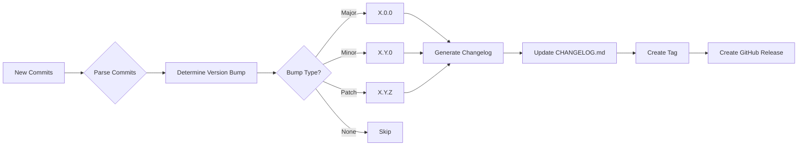

# Release Build Flow Action 🚀


<!-- Created with GitHub Repo Banner by Waren Gonzaga: https://ghrb.waren.build -->

[](https://github.com/marketplace/actions/release-build-flow-action) [](https://opensource.org/licenses/MIT) [](https://github.com/wgtechlabs)

> **Automated release creation and changelog maintenance using Clean Commit convention and Keep a Changelog format.**  
> Zero-intervention release automation with deterministic logic—no AI required!

Stop manually managing versions, changelogs, and GitHub Releases. This action automatically detects new commits, determines version bumps using semantic versioning, generates structured changelogs following the Keep a Changelog format, and creates GitHub Releases—all from your Clean Commit messages.

---

## 📑 Table of Contents

- [Why Use This Action?](#-why-use-this-action)
- [How It Works](#-how-it-works)
- [Features](#-features)
- [Commit Type Mapping](#-commit-type-mapping)
- [Quick Start](#-quick-start)
- [Inputs](#-inputs)
- [Monorepo Support](#-monorepo-support)
- [Outputs](#-outputs)
- [Examples](#-examples)
- [Conventional Commit Examples](#-conventional-commit-examples)
- [Generated CHANGELOG.md Example](#-generated-changelogmd-example)
- [Development](#-development)
- [Troubleshooting](#-troubleshooting)
- [License](#-license)
- [Contributing](#-contributing)
- [Acknowledgments](#-acknowledgments)

---

## 🎯 Why Use This Action?

**The Problem:**  
Managing releases is tedious and error-prone. Teams spend time manually:
- Deciding version numbers
- Writing changelogs
- Creating Git tags
- Publishing GitHub Releases
- Categorizing changes consistently

**The Solution:**  
One action that analyzes your conventional commits and automatically handles everything. Push code with Clean Commit messages, and get semantic versioning, categorized changelogs, and professional releases—every time.

---

## 🔍 How It Works



**Fully deterministic—no AI, no guessing.** The action parses your commit messages, maps types to changelog sections, bumps versions based on configurable rules, and creates releases with structured content.

---

## ✨ Features

- 🎯 **Intelligent Version Bumping** - Automatically determines MAJOR.MINOR.PATCH based on commit types
- 📝 **Keep a Changelog Format** - Maintains CHANGELOG.md with proper sections (Added, Changed, Fixed, etc.)
- 🏷️ **Clean Commit Parsing** - Maps conventional commit types to changelog categories
- 🚀 **GitHub Release Creation** - Automated releases with changelog content
- 🏢 **Monorepo Support** - Per-package versioning, changelogs, and releases for multi-package repositories
- ⚙️ **Highly Configurable** - Customize type mappings, exclusions, and version bump rules
- 🔒 **Deterministic Logic** - No AI dependencies, purely rule-based
- 📊 **Rich Outputs** - Version info, commit counts, categorized change counts, and release URLs

---

## 📋 Commit Type Mapping

This action uses conventional commits (Clean Commit convention) and maps them to Keep a Changelog sections:

| Commit Type | Changelog Section | Examples |
|-------------|-------------------|----------|
| `feat`, `new`, `add` | **Added** | New features, capabilities |
| `fix`, `bugfix`, `revert` | **Fixed** | Bug fixes, corrections, reverts |
| `security` | **Security** | Security patches, vulnerability fixes |
| `perf`, `refactor`, `update`, `change`, `chore`, `setup` | **Changed** | Performance improvements, refactoring, setup tasks |
| `deprecate` | **Deprecated** | Soon-to-be removed features |
| `remove`, `delete` | **Removed** | Removed features, deleted code |

**Breaking Changes:** Commits with `!` suffix or `BREAKING CHANGE` in body trigger **major** version bumps.

**Excluded by default:** `docs`, `style`, `test`, `ci`, `build` (configurable via `exclude-types`)

---

## 🚀 Quick Start

### Basic Usage

```yaml
name: Release

on:
  push:
    branches: [main]

jobs:
  release:
    runs-on: ubuntu-latest
    steps:
      - uses: actions/checkout@v4
        with:
          fetch-depth: 0  # Required for full git history
      
      - name: Create Release
        uses: wgtechlabs/release-build-flow-action@v1
        with:
          github-token: ${{ secrets.GITHUB_TOKEN }}
```

### Custom Configuration

```yaml
- name: Create Release with Custom Settings
  uses: wgtechlabs/release-build-flow-action@v1
  with:
    github-token: ${{ secrets.GITHUB_TOKEN }}
    version-prefix: 'v'
    initial-version: '1.0.0'
    changelog-path: './CHANGELOG.md'
    release-name-template: '{tag} - {date}'
    exclude-types: 'docs,style,test,ci'
```

### Prerelease Support

```yaml
- name: Create Beta Release
  uses: wgtechlabs/release-build-flow-action@v1
  with:
    github-token: ${{ secrets.GITHUB_TOKEN }}
    prerelease-prefix: 'beta'
    release-prerelease: true
```

### Tag Only (No Release)

```yaml
- name: Create Version Tag
  uses: wgtechlabs/release-build-flow-action@v1
  with:
    github-token: ${{ secrets.GITHUB_TOKEN }}
    tag-only: true
```

### Conventional Commits (No Emoji)

```yaml
- name: Create Release with Conventional Commits
  uses: wgtechlabs/release-build-flow-action@v1
  with:
    github-token: ${{ secrets.GITHUB_TOKEN }}
    commit-convention: 'conventional'
```

> **Note:** By default, auto-generated commits (e.g., changelog updates) and tag annotations use Clean Commit convention with emoji prefixes. Set `commit-convention: 'conventional'` to use standard Conventional Commits format instead.
>
> The `commit-convention` setting also adjusts smart defaults for version bump keywords and excluded types:
>
> | Setting | `clean-commit` (default) | `conventional` |
> |---|---|---|
> | Commit format | `☕ chore: ...` | `chore: ...` |
> | Tag format | `🚀 release: v1.2.0` | `Release v1.2.0` |
> | `minor-keywords` | `feat,new,add` | `feat` |
> | `patch-keywords` | `fix,bugfix,security,perf,update,remove` | `fix,perf,revert` |
> | `exclude-types` | `docs,style,test,ci,build,release` | `docs,style,test,ci,build,chore` |
>
> User-provided values always take priority over convention defaults.

---

## 📖 Inputs

### GitHub Configuration

| Input | Description | Default |
|-------|-------------|---------|
| `github-token` | GitHub token for creating releases and tags | `${{ github.token }}` |

### Branch Configuration

| Input | Description | Default |
|-------|-------------|---------|
| `main-branch` | Name of the main/production branch | `main` |
| `dev-branch` | Name of the development branch | `dev` |

### Version Configuration

| Input | Description | Default |
|-------|-------------|---------|
| `version-prefix` | Prefix for version tags (e.g., `v` for `v1.2.3`) | `v` |
| `initial-version` | Initial version if no tags exist (falls back to manifest file version first, then this value) | `0.1.0` |
| `prerelease-prefix` | Prefix for prerelease versions (e.g., `beta`, `alpha`, `rc`) | `` |

> **Version Resolution:** When no git tags exist, the action checks for a version in manifest files (`package.json`, `Cargo.toml`, `pyproject.toml`, `pubspec.yaml`) in priority order. If a valid SemVer version is found, it is used as the starting version. Otherwise, the `initial-version` input is used as the final fallback.

### Changelog Configuration

| Input | Description | Default |
|-------|-------------|---------|
| `changelog-path` | Path to CHANGELOG.md file | `./CHANGELOG.md` |
| `changelog-enabled` | Enable automatic changelog generation | `true` |
| `commit-changelog` | Commit and push changelog changes back to repository | `true` |

### Commit Type Mapping

| Input | Description | Default |
|-------|-------------|---------|
| `commit-type-mapping` | JSON mapping of commit types to changelog sections | Standard mapping |
| `exclude-types` | Comma-separated list of commit types to exclude | `docs,style,test,ci,build,release` |
| `exclude-scopes` | Comma-separated list of commit scopes to exclude | `` |

### Version Bump Rules

| Input | Description | Default |
|-------|-------------|---------|
| `major-keywords` | Keywords that trigger major version bump | `BREAKING CHANGE,BREAKING-CHANGE,breaking` |
| `minor-keywords` | Keywords that trigger minor version bump | `feat,new,add` |
| `patch-keywords` | Keywords that trigger patch version bump | `fix,bugfix,security,perf,update,remove` |

### Release Configuration

| Input | Description | Default |
|-------|-------------|---------|
| `create-release` | Enable GitHub Release creation | `true` |
| `release-draft` | Create release as draft | `false` |
| `release-prerelease` | Mark release as prerelease | `false` |
| `release-name-template` | Template for release name (supports `{tag}`, `{version}`, `{date}`) | `{tag}` |

### Git Configuration

| Input | Description | Default |
|-------|-------------|---------|
| `git-user-name` | Git user name for commits | `WG Tech Labs` |
| `git-user-email` | Git user email for commits | `262751631+wgtechlabs-automation@users.noreply.github.com` |
| `commit-convention` | Commit message convention for auto-generated commits and smart defaults (`clean-commit` or `conventional`) | `clean-commit` |
### Version File Sync

| Input | Description | Default |
|-------|-------------|--------|
| `sync-version-files` | Automatically update version in manifest files (`package.json`, `Cargo.toml`, `pyproject.toml`, `pubspec.yaml`) | `false` |
| `version-file-paths` | Comma-separated paths to manifest files to update (auto-detected if not specified) | `` |

> **Note:** Version file sync runs only when `commit-changelog` and `changelog-enabled` are both `true`. The action auto-detects supported manifest files in the repository root when `version-file-paths` is not specified.
### Advanced Options

| Input | Description | Default |
|-------|-------------|---------|
| `dry-run` | Run without creating tags or releases (testing mode) | `false` |
| `tag-only` | Only create tag without GitHub Release | `false` |
| `update-major-tag` | Automatically update major version tag (e.g., `v1`) to point to latest release. Standard practice for GitHub Actions. | `false` |
| `fetch-depth` | Number of commits to fetch for changelog (0 for all) | `0` |
| `include-all-commits` | Include all commits in changelog, not just since last tag | `false` |

### Monorepo Configuration

| Input | Description | Default |
|-------|-------------|---------|
| `monorepo` | Enable monorepo mode for multi-package repositories | `false` |
| `workspace-detection` | Auto-detect workspace packages from package.json, pnpm-workspace.yaml, etc. | `true` |
| `change-detection` | How to detect affected packages: `scope` (commit scope), `path` (file changes), or `both` | `both` |
| `scope-package-mapping` | JSON mapping of commit scopes to package paths (auto-detected if not provided) | `''` |
| `per-package-changelog` | Generate CHANGELOG.md in each package directory | `true` |
| `root-changelog` | Generate aggregated CHANGELOG.md at repository root | `true` |
| `monorepo-root-release` | Create a unified root release (tag, GitHub Release) using the aggregated root CHANGELOG.md alongside per-package releases | `true` |
| `cascade-bumps` | *(Reserved for future use)* Automatically bump packages that depend on updated packages | `false` |
| `unified-version` | All packages share a single unified version number | `false` |
| `package-manager` | Package manager for workspace detection (`npm`, `bun`, `pnpm`, `yarn`) - auto-detected if not specified | `''` |

---

## 🏢 Monorepo Support

> **Note:** Monorepo features require `@v2` or later.

The action now supports monorepos with **per-package versioning, changelogs, and releases**!

### How It Works

When `monorepo: true` is enabled:

1. **Workspace Detection** - Automatically discovers packages from:
   - `package.json` workspaces field
   - `pnpm-workspace.yaml`
   - `lerna.json`

2. **Smart Routing** - Routes commits to packages based on:
   - **Scope-based**: `feat(core): add feature` → affects `@pkg/core`
   - **Path-based**: Changes to `packages/core/src/` → affects `@pkg/core`
   - **Both**: Combines scope and path detection for maximum accuracy

3. **Per-Package Versioning** - Each package gets independent version bumps:
   - `fix(core):` only bumps `@pkg/core`
   - Commits without scope affect all packages

4. **Per-Package Changelogs** - Generates `CHANGELOG.md` in each package directory

5. **Per-Package Releases** - Creates GitHub releases with scoped tags:
   - `@pkg/core@1.2.0`
   - `@pkg/ui@2.0.1`

6. **Unified Root Release** *(enabled by default via `monorepo-root-release: true`)* - When enabled, creates an additional root-level tag and GitHub Release alongside per-package releases:
   - Root tag: `v2.1.0`
   - Root GitHub Release that references:
     - Aggregated root `CHANGELOG.md` across all packages (if `root-changelog: true`; this aggregation runs regardless of `monorepo-root-release`)
     - Synced root version files such as `package.json` (if `sync-version-files: true`; version syncing also runs independently of `monorepo-root-release`)

   This root tag and GitHub Release enable downstream workflows (e.g., container builds) that trigger on `release: types: [published]` and filter by semver tag patterns like `v1.2.3` to work correctly. Set `monorepo-root-release: false` to keep only per-package tags/releases while still optionally generating a root `CHANGELOG.md` and syncing version files via `root-changelog` and `sync-version-files`.

### Monorepo Example

```yaml
name: Monorepo Release

on:
  push:
    branches: [main]

jobs:
  release:
    runs-on: ubuntu-latest
    steps:
      - name: Checkout code
        uses: actions/checkout@v4
        with:
          fetch-depth: 0
      
      - name: Create Monorepo Releases
        id: release
        uses: wgtechlabs/release-build-flow-action@v2
        with:
          github-token: ${{ secrets.GITHUB_TOKEN }}
          monorepo: true
          workspace-detection: true
          change-detection: both
          per-package-changelog: true
      
      - name: Display Results
        run: |
          echo "Packages Updated: ${{ steps.release.outputs.packages-count }}"
          echo "Details: ${{ steps.release.outputs.packages-updated }}"
```

### Unified Version Mode

For monorepos that want all packages to share a single version:

```yaml
- name: Unified Monorepo Release
  uses: wgtechlabs/release-build-flow-action@v2
  with:
    github-token: ${{ secrets.GITHUB_TOKEN }}
    monorepo: true
    unified-version: true  # All packages bump together
```

### Custom Scope Mapping

Explicitly map commit scopes to package paths:

```yaml
- name: Monorepo with Custom Mapping
  uses: wgtechlabs/release-build-flow-action@v2
  with:
    github-token: ${{ secrets.GITHUB_TOKEN }}
    monorepo: true
    scope-package-mapping: |
      {
        "core": "packages/core",
        "memory": "packages/memory",
        "cli": "src/cli",
        "discord": "plugins/channel/discord"
      }
```

### Monorepo Outputs

| Output | Description |
|--------|-------------|
| `packages-updated` | JSON array of packages that were updated |
| `packages-count` | Number of packages updated |

Each package in `packages-updated` includes:
- `name` - Package name
- `path` - Package directory path
- `oldVersion` - Previous version
- `version` - New version
- `bumpType` - Type of bump (`major`, `minor`, `patch`, `none`)
- `tag` - Generated tag (e.g., `@pkg/core@1.2.0`)

---

## 📤 Outputs

### Version Outputs

| Output | Description |
|--------|-------------|
| `version` | Generated version number (e.g., `1.2.3`) |
| `version-tag` | Full version tag with prefix (e.g., `v1.2.3`) |
| `previous-version` | Previous version number |
| `version-bump-type` | Type of version bump (`major`, `minor`, `patch`, or `none`) |

### Release Outputs

| Output | Description |
|--------|-------------|
| `release-created` | Whether a release was created (`true`/`false`) |
| `release-id` | GitHub Release ID |
| `release-url` | GitHub Release URL |
| `release-upload-url` | GitHub Release upload URL for assets |

### Tag Outputs

| Output | Description |
|--------|-------------|
| `major-tag` | The major version tag that was updated (e.g., `v1`). Empty if `update-major-tag` is disabled. |

### Changelog Outputs

| Output | Description |
|--------|-------------|
| `changelog-updated` | Whether changelog was updated (`true`/`false`) |
| `changelog-entry` | Generated changelog entry for this version |
| `commit-count` | Number of commits included in this release |

### Categorized Commit Counts

| Output | Description |
|--------|-------------|
| `added-count` | Number of Added changes |
| `changed-count` | Number of Changed items |
| `deprecated-count` | Number of Deprecated items |
| `removed-count` | Number of Removed items |
| `fixed-count` | Number of Fixed items |
| `security-count` | Number of Security fixes |

---

## 💡 Examples

### Example 1: Basic Release Workflow

```yaml
name: Release

on:
  push:
    branches: [main]

jobs:
  release:
    runs-on: ubuntu-latest
    steps:
      - name: Checkout code
        uses: actions/checkout@v4
        with:
          fetch-depth: 0
      
      - name: Create Release
        id: release
        uses: wgtechlabs/release-build-flow-action@v1
        with:
          github-token: ${{ secrets.GITHUB_TOKEN }}
      
      - name: Display Results
        run: |
          echo "Version: ${{ steps.release.outputs.version }}"
          echo "Tag: ${{ steps.release.outputs.version-tag }}"
          echo "Release URL: ${{ steps.release.outputs.release-url }}"
          echo "Commits: ${{ steps.release.outputs.commit-count }}"
```

### Example 2: Custom Type Mapping

```yaml
- name: Release with Custom Mapping
  uses: wgtechlabs/release-build-flow-action@v1
  with:
    github-token: ${{ secrets.GITHUB_TOKEN }}
    commit-type-mapping: |
      {
        "feat": "Added",
        "feature": "Added",
        "fix": "Fixed",
        "bug": "Fixed",
        "security": "Security",
        "perf": "Changed",
        "improve": "Changed",
        "deprecate": "Deprecated",
        "remove": "Removed"
      }
```

### Example 3: Monorepo with Scoped Commits

```yaml
- name: Release Backend Package
  uses: wgtechlabs/release-build-flow-action@v1
  with:
    github-token: ${{ secrets.GITHUB_TOKEN }}
    exclude-scopes: 'frontend,docs,infra'  # Only include backend changes
```

### Example 4: Draft Release for Review

```yaml
- name: Create Draft Release
  uses: wgtechlabs/release-build-flow-action@v1
  with:
    github-token: ${{ secrets.GITHUB_TOKEN }}
    release-draft: true
```

### Example 5: Using Outputs for Notifications

```yaml
- name: Create Release
  id: release
  uses: wgtechlabs/release-build-flow-action@v1
  with:
    github-token: ${{ secrets.GITHUB_TOKEN }}

- name: Notify Slack
  if: steps.release.outputs.release-created == 'true'
  run: |
    curl -X POST ${{ secrets.SLACK_WEBHOOK }} \
      -H 'Content-Type: application/json' \
      -d '{
        "text": "🚀 New release: ${{ steps.release.outputs.version-tag }}\nAdded: ${{ steps.release.outputs.added-count }}, Fixed: ${{ steps.release.outputs.fixed-count }}\n${{ steps.release.outputs.release-url }}"
      }'
```

### Example 6: Triggering Downstream Workflows

If you need a GitHub Release to trigger other workflows (e.g., a container build workflow that listens for `release: [published]`), you must use a **PAT or GitHub App token** instead of the default `GITHUB_TOKEN`. Releases created with `GITHUB_TOKEN` will not trigger workflows listening on `release` events (i.e., will not start downstream workflow runs) due to a [GitHub platform limitation](https://docs.github.com/en/actions/security-for-github-actions/security-guides/automatic-token-authentication#using-the-github_token-in-a-workflow).

```yaml
name: Release

on:
  push:
    branches: [main]

jobs:
  release:
    runs-on: ubuntu-latest
    steps:
      - name: Checkout code
        uses: actions/checkout@v4
        with:
          fetch-depth: 0

      - name: Create Release
        id: release
        uses: wgtechlabs/release-build-flow-action@v1
        with:
          # Use a PAT or GitHub App token so the resulting release
          # event triggers downstream workflows (e.g., container builds).
          # GITHUB_TOKEN cannot trigger new workflow runs.
          github-token: ${{ secrets.GH_PAT }}
```

The downstream workflow (e.g., `container-build-flow-action`) will then fire normally:

```yaml
# .github/workflows/container.yml
on:
  release:
    types: [published]  # ✅ Triggered when PAT/App token creates the release
```

---

## 📚 Conventional Commit Examples

Here are examples of commits and their impact on versioning and changelog:

```bash
# MINOR version bump (0.1.0 -> 0.2.0)
feat: add user authentication
feat(api): implement OAuth2 login
new: support multiple themes

# PATCH version bump (0.1.0 -> 0.1.1)
fix: resolve memory leak in worker pool
bugfix(auth): correct token validation
security: patch XSS vulnerability in comments

# MAJOR version bump (0.1.0 -> 1.0.0)
feat!: redesign API endpoints
feat(api)!: change response format
# or in commit body:
feat: new API design

BREAKING CHANGE: Response format changed from XML to JSON

# Changes categorized as "Changed"
perf: improve database query performance
refactor: restructure authentication module
chore: update dependencies

# Changes categorized as "Deprecated"
deprecate: mark legacy API endpoints

# Changes categorized as "Removed"
remove: delete deprecated v1 endpoints

# Excluded from changelog (by default)
docs: update README
style: format code with prettier
test: add unit tests for auth
ci: update GitHub Actions workflow
```

---

## 📝 Generated CHANGELOG.md Example

```markdown
# Changelog

All notable changes to this project will be documented in this file.

The format is based on [Keep a Changelog](https://keepachangelog.com/en/1.1.0/),
and this project adheres to [Semantic Versioning](https://semver.org/spec/v2.0.0.html).

## [Unreleased]

## [1.2.0] - 2024-02-17

### Added
- User authentication with OAuth2
- Support for multiple themes
- Dark mode toggle

### Changed
- Improved database query performance by 40%
- Restructured authentication module for better maintainability

### Fixed
- Resolved memory leak in worker pool
- Corrected token validation in auth middleware

### Security
- Patched XSS vulnerability in comment system

## [1.1.0] - 2024-02-10

### Added
- API rate limiting

### Fixed
- Database connection timeout issues
```

---

## 🛠️ Development

### Testing Locally

To test the action locally without triggering releases:

```yaml
- name: Dry Run Test
  uses: wgtechlabs/release-build-flow-action@v1
  with:
    github-token: ${{ secrets.GITHUB_TOKEN }}
    dry-run: true
```

### Custom Workflows

You can use individual outputs to build custom workflows:

```yaml
- name: Create Release
  id: release
  uses: wgtechlabs/release-build-flow-action@v1
  with:
    github-token: ${{ secrets.GITHUB_TOKEN }}

- name: Build Artifacts
  if: steps.release.outputs.version-bump-type != 'none'
  run: |
    # Build your project
    npm run build
    
- name: Upload Release Assets
  if: steps.release.outputs.release-created == 'true'
  uses: actions/upload-release-asset@v1
  with:
    upload_url: ${{ steps.release.outputs.release-upload-url }}
    asset_path: ./dist/app.zip
    asset_name: app-${{ steps.release.outputs.version }}.zip
    asset_content_type: application/zip
```

---

## 🔧 Troubleshooting

### No version bump detected

**Cause:** No commits with version-bumping types since last release.

**Solution:** Ensure commits use conventional format with types like `feat`, `fix`, `new`, etc.

### Changelog not updating

**Cause:** `changelog-enabled` is set to `false` or no changes to include.

**Solution:** Verify `changelog-enabled: true` and check excluded types.

### Release not created

**Cause:** Insufficient permissions or `create-release` is disabled.

**Solution:** 
- Ensure `github-token` has `contents: write` permission
- Check `create-release` input is set to `true`

### Git permission errors

**Cause:** Action cannot push commits/tags.

**Solution:** Add repository permissions:

```yaml
permissions:
  contents: write
```

### Monorepo: No packages detected

**Cause:** Workspace configuration not found or incorrectly formatted.

**Solution:** 
- Verify `package.json` has a `workspaces` field (for npm/yarn/bun)
- Verify `pnpm-workspace.yaml` exists (for pnpm)
- Check that package directories contain valid `package.json` files
- Enable debug logging to see detection details

### Monorepo: Wrong package affected

**Cause:** Commit scope doesn't match package scope or files are in wrong directory.

**Solution:**
- Use correct scope in commits: `feat(package-name): description`
- Provide explicit `scope-package-mapping` if auto-detection fails
- Set `change-detection: path` to rely only on file changes
- Verify package directories match workspace patterns

### Monorepo: All packages bumping together

**Cause:** Commits without scope affect all packages by default.

**Solution:**
- Always use scoped commits: `fix(core): bug description`
- Set `change-detection: scope` to only use scope-based routing
- Use `unified-version: true` if you want all packages to share one version

### Downstream workflows not triggered after release

**Cause:** GitHub releases created with the default `${{ secrets.GITHUB_TOKEN }}` [do not trigger other workflows](https://docs.github.com/en/actions/security-for-github-actions/security-guides/automatic-token-authentication#using-the-github_token-in-a-workflow) in the same repository. This is an intentional GitHub platform limitation to prevent accidental recursive workflow runs.

This affects chained automation such as:

```
Push to main
  → release-build-flow-action creates GitHub Release
  → container-build-flow-action watches release: [published]
  → ❌ Never triggered because GITHUB_TOKEN created the release
```

**Solution:** Use a Personal Access Token (PAT) or a [GitHub App token](https://docs.github.com/en/apps/creating-github-apps/authenticating-with-a-github-app/making-authenticated-api-requests-with-a-github-app-in-a-github-actions-workflow) instead of `GITHUB_TOKEN`:

```yaml
- name: Create Release
  uses: wgtechlabs/release-build-flow-action@v1
  with:
    github-token: ${{ secrets.GH_PAT }}  # PAT or GitHub App token
```

> **Note:** GitHub App tokens are the recommended approach for production use—they provide fine-grained permissions, are auditable, and don't depend on an individual user's account. See [Example 6](#example-6-triggering-downstream-workflows) for a full setup.

### Creating a Personal Access Token (PAT)

If you choose to use a PAT instead of a GitHub App token, create a **fine-grained personal access token** with the following **minimum repository permissions**:

| Permission | Access | Why it's needed |
|------------|--------|------------------|
| **Contents** | **Read and write** | Push commits (changelog updates), create tags, create releases, and read repository contents |
| **Metadata** | **Read-only** *(required)* | Access repository metadata (automatically included) |

**Steps:**

1. Go to [GitHub Settings → Developer settings → Personal access tokens → Fine-grained tokens](https://github.com/settings/personal-access-tokens/new)
2. Set a descriptive **Token name** (e.g., `release-build-flow`)
3. Choose an **Expiration** period
4. Under **Repository access**, select the repositories that use this action
5. Under **Permissions → Repository permissions**, grant:
   - **Contents**: Read and write
   - **Metadata**: Read-only (selected by default)
6. Click **Generate token** and copy it
7. Add the token as a repository secret named `GH_PAT`:
   - Go to your repository → **Settings → Secrets and variables → Actions**
   - Click **New repository secret**, name it `GH_PAT`, and paste the token

> **Tip:** For organization repositories, an admin may need to approve fine-grained PAT requests depending on the organization's token policy.

---

## 📄 License

MIT © [WG Technology Labs](https://github.com/wgtechlabs)

---

## 🤝 Contributing

Contributions are welcome! Please feel free to submit a Pull Request.

---

## 🙏 Acknowledgments

- [Keep a Changelog](https://keepachangelog.com/) - Changelog format specification
- [Semantic Versioning](https://semver.org/) - Version numbering scheme
- [Conventional Commits](https://www.conventionalcommits.org/) - Commit message convention

---

**Made with ❤️ by [WG Technology Labs](https://github.com/wgtechlabs)**