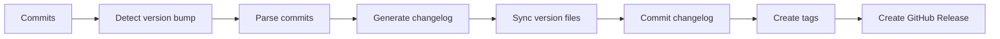

# Release Build Flow Action


[](https://github.com/marketplace/actions/release-build-flow-action) [](https://opensource.org/licenses/MIT) [](https://github.com/wgtechlabs)

Automated release creation, changelog maintenance, version syncing, tagging, and GitHub Releases using Clean Commit or Conventional Commit messages.

## Table of Contents

- [Why Use This Action?](#why-use-this-action)
- [How It Works](#how-it-works)
- [Features](#features)
- [Commit Type Mapping](#commit-type-mapping)
- [Quick Start](#quick-start)
- [Inputs](#inputs)
- [Monorepo Support](#monorepo-support)
- [Outputs](#outputs)
- [Examples](#examples)
- [Conventional Commit Examples](#conventional-commit-examples)
- [Generated CHANGELOG.md Example](#generated-changelogmd-example)
- [Development](#development)
- [Troubleshooting](#troubleshooting)
- [License](#license)
- [Contributing](#contributing)
- [Acknowledgments](#acknowledgments)

## Why Use This Action?

This action turns commit history into releases with minimal workflow code. It can:

- detect semantic version bumps from commit types and breaking changes
- generate Keep a Changelog entries
- update supported manifest versions
- commit changelog and version-file updates
- create release tags and floating major tags like `v1`
- publish GitHub Releases
- support per-package and unified monorepo flows

## How It Works


```mermaid
graph LR
    A[Commits] --> B[Detect version bump]
    B --> C[Parse commits]
    C --> D[Generate changelog]
    D --> E[Sync version files]
    E --> F[Commit changelog]
    F --> G[Create tags]
    G --> H[Create GitHub Release]
```

Versioning is deterministic. When no tags exist, the action first checks `package.json`, `Cargo.toml`, `pyproject.toml`, or `pubspec.yaml`, then falls back to `initial-version`.

## Features

- semantic versioning from commit history
- Clean Commit and Conventional Commit support
- Keep a Changelog generation
- Clean Commit maintenance types flow into `[Unreleased]` until the next release
- optional changelog commit back to the repository
- automatic manifest version syncing for `package.json`, `Cargo.toml`, `pyproject.toml`, and `pubspec.yaml`
- GitHub Release creation with generated notes
- floating major tag updates such as `v1`
- monorepo package detection, per-package bumps, and unified version mode
- structured outputs for downstream workflows

## Commit Type Mapping

Default changelog mapping:

| Commit Type | Section |
| --- | --- |
| `feat`, `new`, `add` | `Added` |
| `fix`, `bugfix`, `revert` | `Fixed` |
| `security` | `Security` |
| `perf`, `refactor`, `update`, `change`, `chore`, `setup`, `docs`, `test`, `release` | `Changed` |
| `deprecate` | `Deprecated` |
| `remove`, `delete` | `Removed` |

Rules:

- `BREAKING CHANGE`, `BREAKING-CHANGE`, `breaking`, or `!` trigger a major bump
- clean-commit defaults use `feat,new,add` for minor and `fix,bugfix,security,perf,update,remove` for patch
- conventional defaults use `feat` for minor and `fix,perf,revert` for patch
- default excluded types are `docs,style,test,ci,build,release`

## Quick Start

### Basic Usage

```yaml
name: Release

on:
  push:
    branches: [main]

permissions:
  contents: write

jobs:
  release:
    runs-on: ubuntu-latest
    steps:
      - uses: actions/checkout@v4
        with:
          fetch-depth: 0

      - uses: wgtechlabs/release-build-flow-action@v1
        with:
          github-token: ${{ secrets.GITHUB_TOKEN }}
```

### Common Options

```yaml
- uses: wgtechlabs/release-build-flow-action@v1
  with:
    github-token: ${{ secrets.GITHUB_TOKEN }}
    changelog-path: ./CHANGELOG.md
    sync-version-files: true
    update-major-tag: true
    release-name-template: '{tag}'
```

### Prerelease Example

```yaml
- uses: wgtechlabs/release-build-flow-action@v1
  with:
    github-token: ${{ secrets.GITHUB_TOKEN }}
    prerelease-prefix: beta
    release-prerelease: true
```

### Tag-Only Example

```yaml
- uses: wgtechlabs/release-build-flow-action@v1
  with:
    github-token: ${{ secrets.GITHUB_TOKEN }}
    tag-only: true
```

## Inputs

### GitHub Configuration

| Input | Description | Default |
| --- | --- | --- |
| `github-token` | Token used for tags, releases, and pushes | `${{ github.token }}` |

### Branch Configuration

| Input | Description | Default |
| --- | --- | --- |
| `main-branch` | Production branch name. The action fails when the current branch does not match. | `main` |

### Version Configuration

| Input | Description | Default |
| --- | --- | --- |
| `version-prefix` | Prefix for release tags | `v` |
| `initial-version` | Fallback version when no tags or manifest version exist | `0.1.0` |
| `prerelease-prefix` | Prefix for prerelease versions | `` |
| `major-keywords` | Comma-separated keywords that trigger major bumps | `BREAKING CHANGE,BREAKING-CHANGE,breaking` |
| `minor-keywords` | Comma-separated keywords that trigger minor bumps | `feat,new,add` |
| `patch-keywords` | Comma-separated keywords that trigger patch bumps | `fix,bugfix,security,perf,update,remove` |
| `fetch-depth` | Number of commits fetched for changelog generation, `0` for all | `0` |
| `include-all-commits` | Include all commits instead of only commits since the last tag | `false` |

### Changelog Configuration

| Input | Description | Default |
| --- | --- | --- |
| `changelog-path` | Path to the root changelog | `./CHANGELOG.md` |
| `changelog-enabled` | Generate changelog entries | `true` |
| `commit-changelog` | Commit changelog and version-file updates | `true` |
| `commit-type-mapping` | JSON map from commit types to changelog sections | standard mapping |
| `exclude-types` | Comma-separated commit types to skip | `style,ci,build` |
| `exclude-scopes` | Comma-separated scopes to skip | `` |

### Release Configuration

| Input | Description | Default |
| --- | --- | --- |
| `create-release` | Create a GitHub Release | `true` |
| `release-draft` | Publish release as draft | `false` |
| `release-prerelease` | Mark release as prerelease | `false` |
| `release-name-template` | Template using `{tag}`, `{version}`, and `{date}` | `{tag}` |
| `tag-only` | Create tags but skip GitHub Release | `false` |
| `dry-run` | Skip pushes and release creation | `false` |
| `update-major-tag` | Update major tag such as `v1` to the release commit | `false` |

### Git Configuration

| Input | Description | Default |
| --- | --- | --- |
| `git-user-name` | Git identity used for generated commits | `WG Tech Labs` |
| `git-user-email` | Git email used for generated commits | `262751631+wgtechlabs-automation@users.noreply.github.com` |
| `commit-convention` | Convention for generated commits and smart defaults | `clean-commit` |

### Version File Sync

| Input | Description | Default |
| --- | --- | --- |
| `sync-version-files` | Update manifest versions automatically | `true` |
| `version-file-paths` | Comma-separated manifest paths, auto-detected when omitted | `` |

Supported files: `package.json`, `Cargo.toml`, `pyproject.toml`, `pubspec.yaml`.

### Monorepo Configuration

| Input | Description | Default |
| --- | --- | --- |
| `monorepo` | Enable monorepo mode | `false` |
| `workspace-detection` | Auto-detect workspaces | `true` |
| `change-detection` | Route package changes by `scope`, `path`, or `both` | `both` |
| `scope-package-mapping` | Explicit JSON map of commit scopes to package paths | `` |
| `per-package-changelog` | Write package-level changelogs | `true` |
| `root-changelog` | Write aggregated root changelog | `true` |
| `monorepo-root-release` | Create root tag and GitHub Release alongside package releases | `true` |
| `unified-version` | Use one shared version for all packages | `false` |
| `cascade-bumps` | Reserved for future use | `false` |
| `package-manager` | `npm`, `bun`, `pnpm`, or `yarn`; auto-detected when omitted | `` |

## Monorepo Support

When `monorepo: true` is enabled, the action can:

- discover packages from supported workspace files
- route commits by scope, changed paths, or both
- calculate per-package or unified bumps
- generate package changelogs and a root changelog
- create package tags such as `@scope/pkg@1.2.0`
- optionally create a root release tag such as `v1.2.0`

### Monorepo Example

```yaml
name: Monorepo Release

on:
  push:
    branches: [main]

permissions:
  contents: write

jobs:
  release:
    runs-on: ubuntu-latest
    steps:
      - uses: actions/checkout@v4
        with:
          fetch-depth: 0

      - id: release
        uses: wgtechlabs/release-build-flow-action@v1
        with:
          github-token: ${{ secrets.GITHUB_TOKEN }}
          monorepo: true
          change-detection: both
          per-package-changelog: true
          monorepo-root-release: true
```

### Unified Version Mode

```yaml
- uses: wgtechlabs/release-build-flow-action@v1
  with:
    github-token: ${{ secrets.GITHUB_TOKEN }}
    monorepo: true
    unified-version: true
```

### Custom Scope Mapping

```yaml
- uses: wgtechlabs/release-build-flow-action@v1
  with:
    github-token: ${{ secrets.GITHUB_TOKEN }}
    monorepo: true
    scope-package-mapping: |
      {
        "core": "packages/core",
        "cli": "packages/cli"
      }
```

## Outputs

### Version Outputs

| Output | Description |
| --- | --- |
| `version` | Generated version number |
| `version-tag` | Full tag with prefix |
| `previous-version` | Previous version number |
| `version-bump-type` | `major`, `minor`, `patch`, or `none` |

### Release Outputs

| Output | Description |
| --- | --- |
| `release-created` | Whether a GitHub Release was created |
| `release-id` | GitHub Release ID |
| `release-url` | GitHub Release URL |
| `release-upload-url` | Upload URL for release assets |

### Tag Outputs

| Output | Description |
| --- | --- |
| `major-tag` | Updated floating major tag, or empty when disabled |

### Changelog Outputs

| Output | Description |
| --- | --- |
| `changelog-updated` | Whether the changelog changed |
| `changelog-entry` | Generated changelog entry |
| `commit-count` | Number of commits in the release |

### Categorized Commit Counts

| Output | Description |
| --- | --- |
| `added-count` | Number of `Added` items |
| `changed-count` | Number of `Changed` items |
| `deprecated-count` | Number of `Deprecated` items |
| `removed-count` | Number of `Removed` items |
| `fixed-count` | Number of `Fixed` items |
| `security-count` | Number of `Security` items |

### Monorepo Outputs

| Output | Description |
| --- | --- |
| `packages-updated` | Compact JSON array of updated packages |
| `packages-count` | Number of updated packages |

## Examples

### Example 1: Basic Release Workflow

```yaml
name: Release

on:
  push:
    branches: [main]

permissions:
  contents: write

jobs:
  release:
    runs-on: ubuntu-latest
    steps:
      - uses: actions/checkout@v4
        with:
          fetch-depth: 0

      - id: release
        uses: wgtechlabs/release-build-flow-action@v1
        with:
          github-token: ${{ secrets.GITHUB_TOKEN }}

      - run: |
          echo "Version: ${{ steps.release.outputs.version }}"
          echo "Tag: ${{ steps.release.outputs.version-tag }}"
          echo "URL: ${{ steps.release.outputs.release-url }}"
```

### Example 2: Custom Mapping and Exclusions

```yaml
- uses: wgtechlabs/release-build-flow-action@v1
  with:
    github-token: ${{ secrets.GITHUB_TOKEN }}
    exclude-scopes: frontend,docs
    commit-type-mapping: |
      {
        "feat": "Added",
        "fix": "Fixed",
        "security": "Security",
        "perf": "Changed",
        "remove": "Removed"
      }
```

### Example 3: Draft Release

```yaml
- uses: wgtechlabs/release-build-flow-action@v1
  with:
    github-token: ${{ secrets.GITHUB_TOKEN }}
    release-draft: true
```

### Example 4: Notifications

```yaml
- id: release
  uses: wgtechlabs/release-build-flow-action@v1
  with:
    github-token: ${{ secrets.GITHUB_TOKEN }}

- if: steps.release.outputs.release-created == 'true'
  run: |
    echo "Released ${{ steps.release.outputs.version-tag }}"
    echo "Fixed: ${{ steps.release.outputs.fixed-count }}"
```

### Example 5: Downstream Release Triggers

Releases created with the default `GITHUB_TOKEN` do not trigger other workflows listening for `release` events in the same repository. Use a PAT or GitHub App token if you need downstream release workflows.

```yaml
- uses: wgtechlabs/release-build-flow-action@v1
  with:
    github-token: ${{ secrets.GH_PAT }}
```

## Conventional Commit Examples

```bash
# minor
feat: add user authentication
new: support themes

# patch
fix: resolve worker leak
bugfix(auth): correct token validation
security: patch XSS issue

# major
feat(api)!: change response format

# changed
perf: improve query performance
refactor: simplify auth module
setup: update release workflow

# deprecated
deprecate: mark legacy API as deprecated

# removed
remove: delete deprecated v1 endpoints

# excluded by default
docs: update README
test: add unit tests
ci: update workflow
```

## Generated CHANGELOG.md Example

```markdown
# Changelog

All notable changes to this project will be documented in this file.

The format is based on Keep a Changelog,
and this project adheres to Semantic Versioning.

## [Unreleased]

## [1.2.0] - 2026-03-09

### Added

- User authentication with OAuth2

### Changed

- Improved query performance

### Fixed

- Corrected token validation

### Security

- Patched XSS vulnerability
```

## Development

### Testing Locally

```bash
bash run-tests.sh
```

### Dry Run Workflow

```yaml
- uses: wgtechlabs/release-build-flow-action@v1
  with:
    github-token: ${{ secrets.GITHUB_TOKEN }}
    dry-run: true
```

### Custom Workflows

Use outputs such as `version-tag`, `release-url`, `packages-updated`, and `major-tag` to chain builds, notifications, or artifact publishing.

## Troubleshooting

### No version bump detected

Use version-bumping commit types such as `feat`, `new`, `add`, `fix`, `bugfix`, `security`, `perf`, `update`, or `remove`.

### Action failed on the wrong branch

The action enforces `main-branch` as a production-branch guard. Run it on the configured branch or change `main-branch` to match your production branch.

### Changelog not updating

Check `changelog-enabled`, `exclude-types`, and `exclude-scopes`.

### Release not created

Ensure:

- `permissions.contents: write` is set in the workflow
- `create-release` is `true`
- `dry-run` is `false`

### Push or tag permission errors

Grant:

```yaml
permissions:
  contents: write
```

### Monorepo packages not detected

Check workspace files, package manifests, and `workspace-detection`.

### Wrong monorepo package updated

Use scoped commits, verify package paths, or provide `scope-package-mapping`.

### Downstream workflows not triggered

Use a PAT or GitHub App token instead of the default `GITHUB_TOKEN` when another workflow depends on `release` events.

## License

MIT. See [LICENSE](LICENSE).

## Contributing

Contributions are welcome. See [CONTRIBUTING.md](CONTRIBUTING.md).

## Acknowledgments

- [Keep a Changelog](https://keepachangelog.com/)
- [Semantic Versioning](https://semver.org/)
- [Clean Commit](https://github.com/wgtechlabs/clean-commit)
